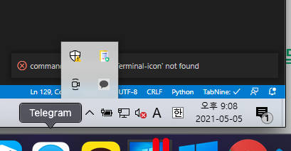
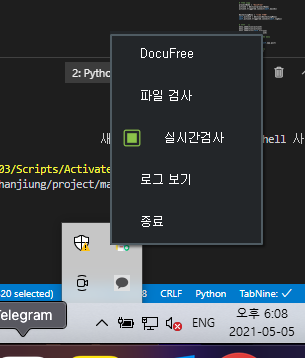
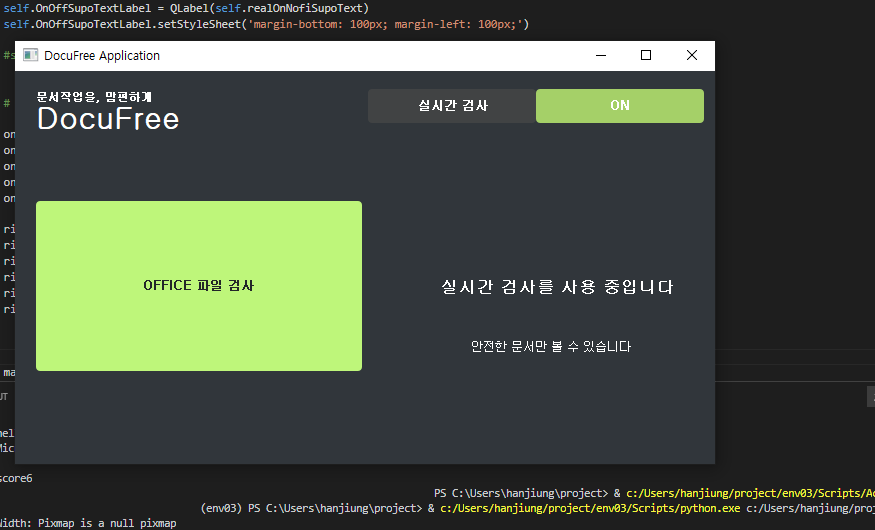
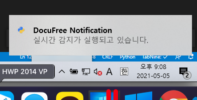
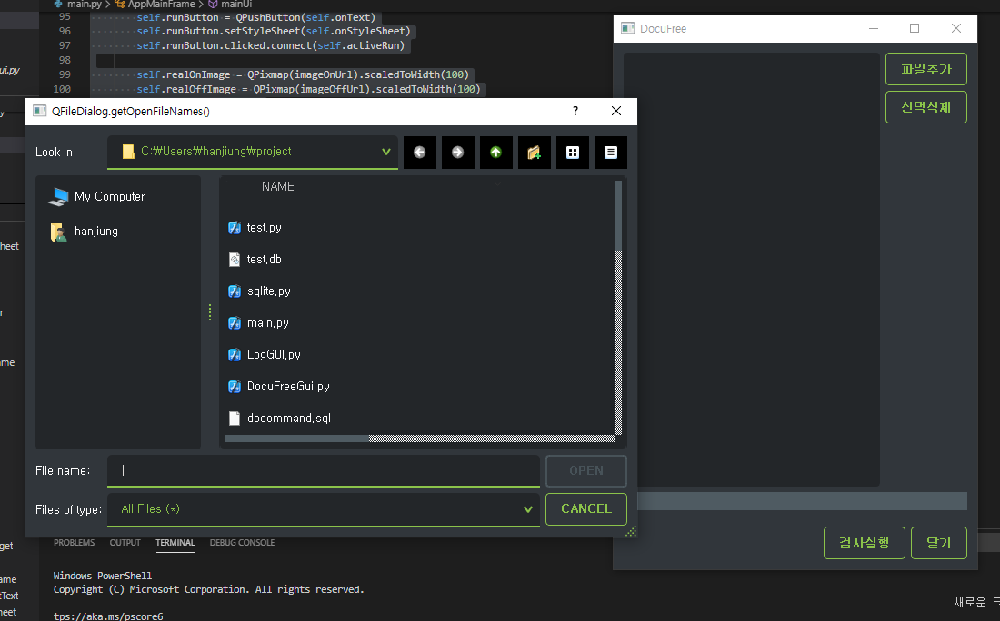

## GUI 소스코드 임시 저장소

> 해당 저장소는 현재 진행중인 프로잭트를 정리하기 위해서 만들어진 저장소입니다.

  

## 시스템 트레이 메인

- 메인 GUI 켜두어야하는 불편함해소
  

## 시스템 트레이 옵션 작업물

- 옵션값 다각화
  

## 메인 작업물

- 메인창 만들기
  

## 윈도우 토스트 메세지 알림

- 빠른 확인

  
## 윈도우 파일 선택 추가

- 파일 검사 추가, 삭제 기능 
